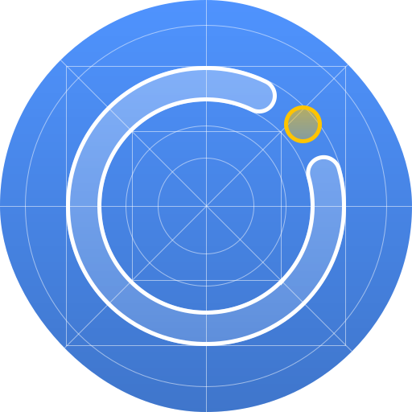

<p align="center"></p>
<h1 align="center">entcore-api</h1>

<p align="center">
  <a href="https://www.npmjs.com/package/entcore-api"></a>
  <a href="https://www.npmjs.com/package/entcore-api"></a>
  <a href="https://www.npmjs.com/package/entcore-api"></a>
  <a href="https://www.npmjs.com/package/entcore-api"></a>
</p>


> [!warning]
> Ce projet n'est pas lié au service Neo / One ou à l'entreprise Édifice de quelques manières qu'il soit.

## 📝 Description
`entcore-api` est un module TypeScript permettant d'interagir avec les modules exposés par une instance ENT basée sur ENTCore.  

## ⚡️ ENT compatible

### Nouvelle-Aquitaine
<p>
  
  <h4>ENT16</h4>
</p>
<p>
  
  <h4>Lycée connectée</h4>
</p>

<br>

> **👉 Ton ENT manque ?** N'hésite pas à faire une issue, ou à contribuer.

## 📦 Installation
```
npm install entcore-api
```

## 🧩 Modules supportés
- [ ] Audience (audience)
- [x] Authentification (auth)
> [!NOTE]
> Supporte uniquement la connexion avec WAYF / SAML pour le moment
- [ ] Blog (blog)
- [ ] Mur collaboratif (collaborativewall)
- [ ] Connecteur (connectors)
- [x] Messagerie (conversation)
- [ ] Explorateur de média (explorer)
- [ ] Formulaire (form)
- [ ] Aide au devoir (homework-assistance)
- [ ] Devoir (homework)
- [x] Mediacentre (mediacentre)
- [ ] Applications (apps)
- [ ] Actualités (news)
- [x] Pronote (pronote)
- [ ] - (schoolbook)
- [ ] - (splashads)
- [ ] Support (support)
- [ ] Fil de nouveauté (timeline)
- [ ] Utilisateur (user)
- [ ] Vie scolaire (viescolaire)
- [ ] Wiki (wiki)
- [ ] Espace de travail (workspace)
- [ ] Zimbra (zimbra)

## 🚀 Premiers pas
Le module `entcore-api` fonctionne à partir d'un client, ce client dispose de sous-classe correspondant à chaque module fourni par entcore. Voici un exemple minimal d’utilisation :
```js
void async function main () {
  // New entcore client
	const instance = new NeoClient("https://myneoinstance.edifice.io");

  // Init the session by a token
	await instance.auth.refreshToken("myrefreshtoken");

  // List user inbox with conversation module
  const inbox = await instance.conversation.listFolder(NeoConversationSystemFolder.INBOX)

  // List available mediacentre ressources from GAR with mediacentre module
  const sources = await instance.mediacentre.getResourcesFromSource(NeoMediacentreSource.GAR);
  
	process.exit(0);
}();
```

## 🤝 Contribution

Les contributions sont les bienvenues ! Tu peux contribuer en forkant le projet. Mais n'oublie pas ces quelques règles de contribution :
- Lorsque tu implémentes un module, n'oublie pas de faire une nouvelle classe.
- Tous les endpoints doivent se trouver dans le fichier `src/rest/endpoints.ts`
- Tout appel à l'API doit se faire via le `RESTManager`.
- Évite de mettre des type `any`. Utilise le seulement en cas de nécessité.
- Si tu ajoutes un nouveau module, n'oublie pas de créer un fichier d'exemple.

Si tu veux discuter d’une idée avant de te lancer, n’hésite pas à ouvrir une **issue**.

## 📄 Licence
Ce projet est distribué sous licence **GPL v3**.  
Voir le fichier [LICENSE](./LICENSE) pour plus d’informations.
